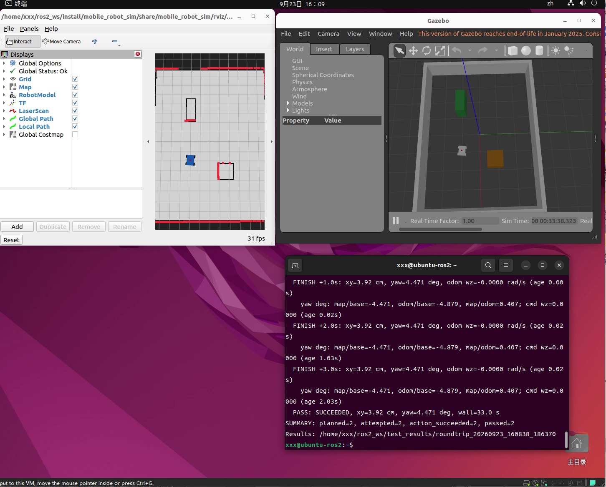

# ROS 2 / Nav2 移动机器人导航仿真系统

基于 Ubuntu 22.04、ROS 2 Humble 与 Gazebo Classic 11，完成四轮底盘仿真、定位、自主导航、静态绕障和自动往返验收。

## 演示

[观看 B→A 导航视频（约 81 秒）](ros2_mobile_robot_sim/media/navigation_demo_20260923.mp4)



## 工程工作

- 集成机器人模型、激光、里程计、AMCL、Nav2 全局规划与局部控制。
- 利用 rosbag、TF 与 DWB 评分分析规划失败和到点后误差跳变。
- 在记录的地图快照上对照 NavFn Dijkstra/A*；结合目标变换时间戳修复和 AMCL 更新阈值试验，建立固定场景导航基线。
- 记录返回成功后 +0.5、+1、+2、+3 秒的定位误差，区分 action 成功与外部验收。

## 已记录的验证

最终显式配置短测 2/2、长测 20/20、进程重启复验 2/2，共 24/24 段通过。
停车后采样最大位置误差 9.5085 cm，角度误差 5.4228°；原验收门限为 0.15 m / 0.15 rad。
演示视频是独立的一轮运行，不纳入这 24 段计数。

验证限于当前静态房间和固定 A/B 路线；map TF 误差不是独立真值测量，world odom 来自仿真。
不代表动态障碍、任意目标或实物机器人验证完成。开发使用了 AI 工具协助。

## 文档

- [项目与环境说明](ros2_mobile_robot_sim/README.md)
- [最终配置、证据索引和启动方式](ros2_mobile_robot_sim/AMCL_UPDATE_TRIAL.md)
- [导航诊断过程](ros2_mobile_robot_sim/NAVIGATION.md)
- [建图](ros2_mobile_robot_sim/MAPPING.md) / [定位](ros2_mobile_robot_sim/LOCALIZATION.md)

复现最终组合还依赖两个修复工作区和 Ubuntu 保存的地图，不能仅凭本仓库目录完整重建已验证环境。
具体依赖见上述验证说明。

## 源码目录与运行条件

ROS 包位于 `ros2_mobile_robot_sim/`，包名为 `mobile_robot_sim`。

```bash
mkdir -p ~/ros2_ws/src
cd ~/ros2_ws/src
git clone https://github.com/xhb123456-oss/ros2_mobile_robot.git
cd ~/ros2_ws
source /opt/ros/humble/setup.bash
rosdep install --from-paths src --ignore-src -r -y
colcon build --packages-select mobile_robot_sim --symlink-install
source install/setup.bash
ros2 launch mobile_robot_sim simulation.launch.py
```

以上为基础仿真构建流程，不会自动复现最终导航组合。最终组合需要保存的地图、TF2 和 Nav2 控制器修复工作区，详见 [复现条件](REPRODUCIBILITY.md)。

[旧版 v0.1.0 基础运动演示](https://github.com/xhb123456-oss/ros2_mobile_robot/releases/tag/v0.1.0) 作为历史版本保留。
